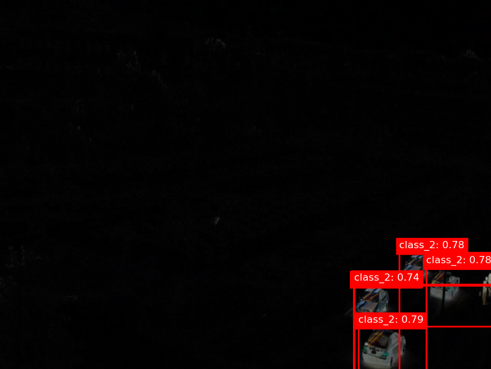
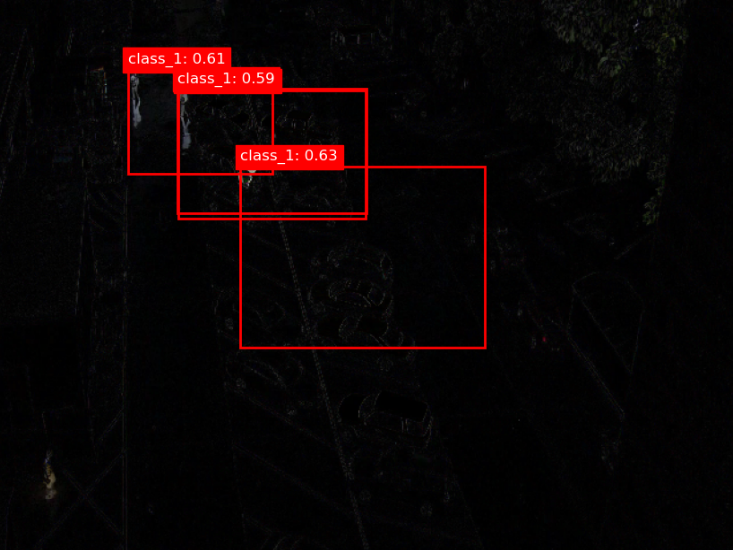

# DETR Fine-tuning Pipeline: Technical Report

## Table of Contents

- [DETR Fine-tuning Pipeline: Technical Report](#detr-fine-tuning-pipeline-technical-report)
  - [Table of Contents](#table-of-contents)
  - [1. Introduction](#1-introduction)
  - [2. Dataset Construction](#2-dataset-construction)
    - [2.1 Annotation Format](#21-annotation-format)
    - [2.2 Dataset Preparation and Splitting](#22-dataset-preparation-and-splitting)
    - [2.3 Custom Dataset Class](#23-custom-dataset-class)
  - [3. Preprocessing Pipeline](#3-preprocessing-pipeline)
    - [3.1 Image Processor](#31-image-processor)
    - [3.2 Image Diff Strategy](#32-image-diff-strategy)
  - [4. Model Architecture and Selection](#4-model-architecture-and-selection)
    - [4.1 DETR Overview](#41-detr-overview)
    - [4.2 Model Loading and Configuration](#42-model-loading-and-configuration)
    - [4.3 Transfer Learning Rationale](#43-transfer-learning-rationale)
  - [5. Training Pipeline](#5-training-pipeline)
    - [5.1 Training Arguments and Hyperparameters](#51-training-arguments-and-hyperparameters)
    - [5.2 Trainer Setup](#52-trainer-setup)
    - [5.3 Training Strategies](#53-training-strategies)
    - [5.4 Logging and Monitoring](#54-logging-and-monitoring)
  - [6. Evaluation and Results](#6-evaluation-and-results)
    - [6.1 Quantitative Metrics](#61-quantitative-metrics)
    - [6.2 Qualitative Analysis](#62-qualitative-analysis)
    - [6.3 Failure Modes and Limitations](#63-failure-modes-and-limitations)
  - [7. Assumptions and Workarounds](#7-assumptions-and-workarounds)
  - [8. Pipeline Summary](#8-pipeline-summary)
  - [9. Future Improvements](#9-future-improvements)
  - [10. References](#10-references)

---

## 1. Introduction

This report details the technical approach, implementation, and rationale for fine-tuning a DETR (DEtection TRansformer) model for object detection on a custom dataset. The pipeline covers data ingestion, preprocessing, model adaptation, training, evaluation, and analysis of results, with a focus on reproducibility and extensibility.

---

## 2. Dataset Construction

### 2.1 Annotation Format

- **File Structure:** Each image is paired with a `.txt` annotation file in a dedicated directory.
- **Annotation Content:** Each line in an annotation file encodes a single object as:

  ```
  <class_id> <x_center> <y_center> <width> <height>
  ```
  
  - All coordinates are normalized to [0, 1] relative to image dimensions.
  - Example:

    ```
    0 0.512 0.433 0.120 0.210
    2 0.700 0.600 0.100 0.150
    ```

- **Assumptions:** All annotation files are present, correctly formatted, and correspond to existing images.

### 2.2 Dataset Preparation and Splitting

- **Discovery:** The pipeline recursively scans the annotation directory for `.txt` files.
- **Integrity Check:** Ensures each annotation file has a corresponding image.
- **Splitting:** Dataset is split into training and validation subsets using a configurable ratio (e.g., 80/20) and a fixed random seed for reproducibility.
- **Development Subset:** For rapid prototyping, a small subset (e.g., first 10 files) can be used.

### 2.3 Custom Dataset Class

- **Class:** `MovedObjectDataset`
- **Responsibilities:**
  - Loads image-annotation pairs.
  - Applies preprocessing (including image diffs, see [3.2](#32-image-diff-strategy)).
  - Integrates with HuggingFace image processor for normalization and resizing.
  - Returns data in the format expected by DETR (image tensor, target dict with boxes and labels).
- **Design Note:** Manual resizing is avoided; the image processor handles all resizing and normalization.

---

## 3. Preprocessing Pipeline

### 3.1 Image Processor

- **Library:** HuggingFace Transformers
- **Model:** `facebook/detr-resnet-50`
- **Functionality:**
  - Converts PIL images to normalized tensors.
  - Resizes images to the input size expected by DETR.
  - Applies mean/std normalization as per pre-trained model requirements.
- **Initialization:** Loaded once at pipeline start for efficiency.

### 3.2 Image Diff Strategy

- **Motivation:** To enhance detection of moved objects, the pipeline computes the pixel-wise difference between "before" and "after" images.
- **Implementation:**
  - Both images are loaded and aligned.
  - The absolute difference is computed per channel.
  - The resulting diff image is passed to the image processor.
- **Rationale:** Image diffs provide a richer representation for detecting object movement compared to feature diffs, as they directly highlight changes in the scene.

---

## 4. Model Architecture and Selection

### 4.1 DETR Overview

- **Architecture:** DETR combines a CNN backbone (ResNet-50) with a transformer encoder-decoder and a set-based global loss for direct set prediction of bounding boxes and class labels.
- **Advantages:**
  - End-to-end object detection without anchor boxes or NMS.
  - Strong performance on standard benchmarks.

### 4.2 Model Loading and Configuration

- **Loading:** Model is loaded via a `load_model()` utility, which:
  - Loads pre-trained weights (`facebook/detr-resnet-50`).
  - Adapts the classification head to match the number of custom classes.
  - Moves the model to the configured device (CPU/GPU).
- **Freezing/Unfreezing:** Supports selective freezing of backbone or transformer layers for staged training.

### 4.3 Transfer Learning Rationale

- **Why Transfer Learning?**
  - Leverages pre-trained visual and spatial representations.
  - Reduces data requirements and accelerates convergence.
- **Image Diff vs. Feature Diff:**
  - Image diffs are preferred for this task, as they directly encode scene changes, which is critical for moved object detection.

---

## 5. Training Pipeline

### 5.1 Training Arguments and Hyperparameters

- **Configurable Parameters:**
  - Batch size (raw and simulated via gradient accumulation)
  - Number of epochs
  - Learning rate and scheduler type
  - Device (CPU/GPU)
  - Logging and checkpoint intervals
- **Example Configuration:**
  
  ```python
  batch_size = 2  # Tesla T4 GPU
  gradient_accumulation_steps = 16  # Simulated batch size = 32
  learning_rate = 1e-4
  lr_scheduler_type = "cosine_with_restarts"
  num_epochs = 80
  ```

### 5.2 Trainer Setup

- **Framework:** HuggingFace `Trainer`
- **Custom Data Collator:** Handles batching of variable-sized images and targets.
- **Evaluation:** Runs after every N steps/epochs; supports custom metrics.
- **Callbacks:** TensorBoard logging, model checkpointing, and early stopping.

### 5.3 Training Strategies

- **Staged Training:**
  1. **Stage 1:** Freeze encoder/decoder; train only classification head (20 epochs, LR=1e-4).
  2. **Stage 2:** Unfreeze all layers; reduce LR to 5e-5 (20 epochs).
  3. **Stage 3:** Further reduce LR to 1e-5; train all layers (80 epochs).
- **Gradient Accumulation:** Used to simulate larger batch sizes for stable training on limited GPU memory.
- **Learning Rate Scheduling:** Cosine annealing with restarts every 5 cycles to escape local minima and encourage exploration.

### 5.4 Logging and Monitoring

- **TensorBoard:** Tracks training/validation loss, learning rate, and custom metrics.
- **Model Checkpoints:** Best model saved based on validation loss.
- **Evaluation Frequency:** Every 20 iterations for close monitoring.

---

## 6. Evaluation and Results

### 6.1 Quantitative Metrics

- **Primary Metric:** Validation loss (cross-entropy + bounding box loss).
- **Additional Metrics:** Precision, recall, F1-score as a function of IoU and score thresholds.
- **Results:**
  - **Stage 1:** Train loss ≈ 2.1, Eval loss ≈ 2.38
  - **Stage 2:** Train loss ≈ 1.56, Eval loss ≈ 1.62
  - **Stage 3:** Train loss ≈ 0.44, Eval loss ≈ 0.6 (minor overfitting)
- **Interpretation:** Progressive reduction in loss and improved precision after staged unfreezing and LR reduction.

### 6.2 Qualitative Analysis

- **Visualization:** Bounding boxes and class labels overlaid on image diffs.
- **Success Example:** Accurate detection of moved objects.
  - 
- **Failure Example:** Camera movement introduces excessive diff, leading to false positives.
  - 
  - Only 2 objects should have been predicted.

### 6.3 Failure Modes and Limitations

- **Camera Movement:** Large scene changes degrade diff quality and model performance.
- **Data Scarcity:** Limited training data restricts achievable precision and recall.
- **Mitigation:** Increasing score threshold improves precision but may reduce recall.

---

## 7. Assumptions and Workarounds

- All annotation files are present and correctly formatted.
- Image and annotation directories are specified in the config.
- Image processor and model loader are compatible with the dataset.
- For rapid iteration, a subset of data may be used during development.

---

## 8. Pipeline Summary

1. **Initialize:** Set up output and logging directories.
2. **Load Processor:** Prepare image processor for preprocessing.
3. **Prepare Dataset:** Discover annotation files, split into train/val, instantiate dataset objects.
4. **Load Model:** Load and configure DETR model.
5. **Set Training Args:** Define hyperparameters and logging.
6. **Setup Trainer:** Use HuggingFace Trainer for training and evaluation.
7. **Monitor:** Log metrics and save best model.
8. **In-depth Evaluation:** Compute precision, recall, F1 as a function of IoU and score thresholds; perform qualitative analysis.

---

## 9. Future Improvements

- **Data Augmentation:** Incorporate geometric and photometric augmentations to improve generalization.
- **Hyperparameter Optimization:** Integrate automated search (e.g., Optuna, Ray Tune).
- **Advanced Evaluation:** Add mAP (mean Average Precision) and per-class metrics.
- **Robustness:** Explore feature-diff approaches and camera motion compensation.

---

## 10. References

- [DETR: End-to-End Object Detection with Transformers](https://arxiv.org/abs/2005.12872)
- [HuggingFace Transformers Documentation](https://huggingface.co/docs/transformers/)
- [COCO Dataset Format](https://cocodataset.org/#format-data)
